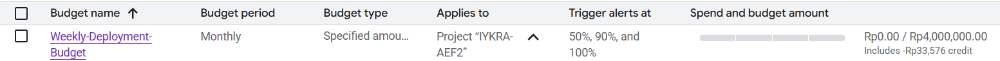
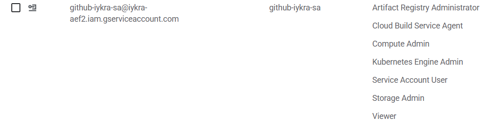
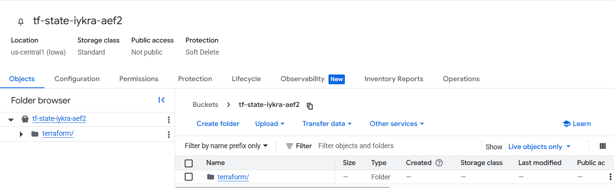
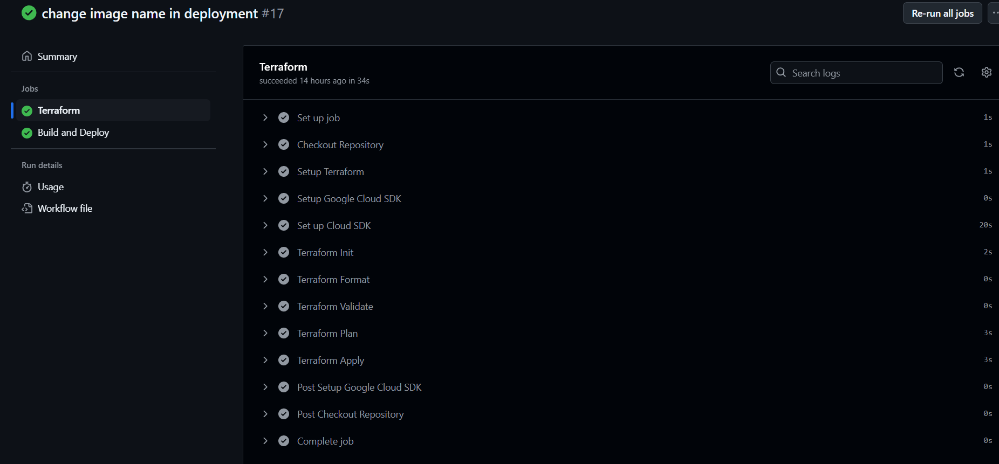
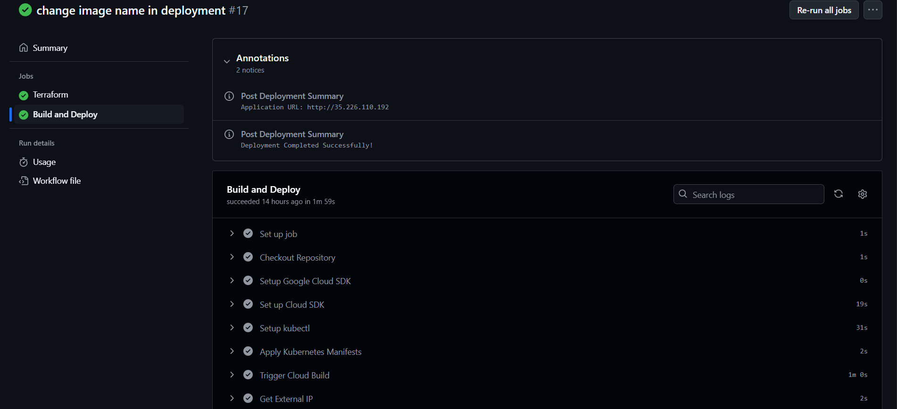
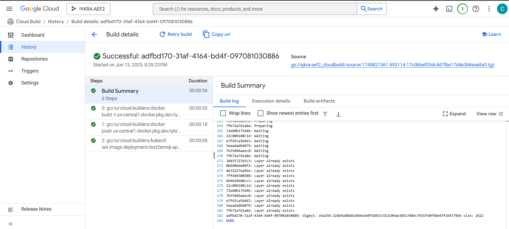
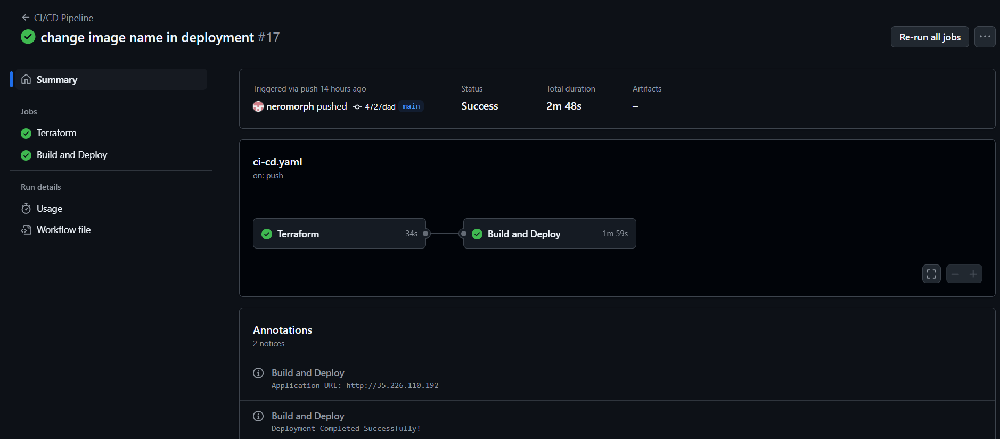
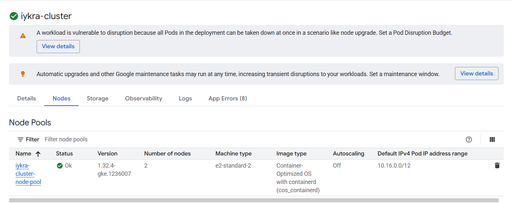
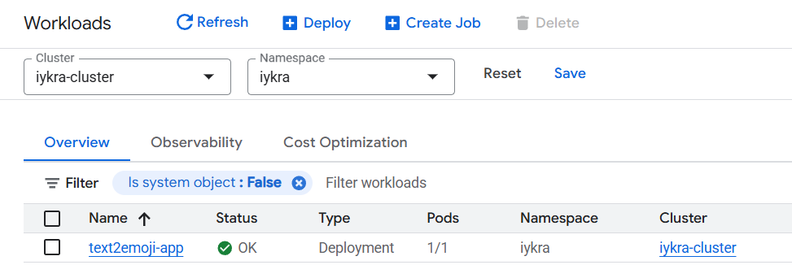
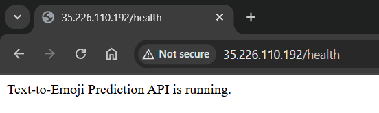

# Weekly 4 Assignment

## GCP Budget Alert

This assignment involves setting up a budget alert in Google Cloud Platform (GCP) to monitor and manage your spending effectively. The goal is to create a budget that triggers an alert when your spending reaches a certain threshold.


## Deployment

The deployment of the Text2Emoji application is done using Kubernetes. The deployment configuration is defined in a YAML file, which specifies the container image, resource limits, and readiness probes.

- Region: **us-central1**
- Project ID: **iykra-aef2**

### 1. GCP Resources Pre-requisites
- Service Account with needed roles.

- GCS bucket for storing the terraform state file.


### 2. Deployment File Setup in Git Repository
- [Dockerfile](https://github.com/neromorph/text2emoji/blob/main/Dockerfile) for building the application image.
- [cloudbuild.yaml](https://github.com/neromorph/text2emoji/blob/main/cloudbuild.yaml) for building the Docker image and pushing it to Google Artifact Registry then update the Kubernetes deployment by using set latest docker image tag.
- [Kubernetes manifest files](https://github.com/neromorph/text2emoji/tree/main/kubernetes) containing deployment and service configurations:
  - [deployment.yaml](https://github.com/neromorph/text2emoji/blob/main/kubernetes/deployment.yaml)
  - [service.yaml](https://github.com/neromorph/text2emoji/blob/main/kubernetes/svc.yaml)
  - [namespace.yaml](https://github.com/neromorph/text2emoji/blob/main/kubernetes/namespace.yaml)
- [Terraform](https://github.com/neromorph/text2emoji/tree/main/terraform) configuration files for deploying the Kubernetes resources and setting up the GCP infrastructure so that the application can run in a managed environment which includes:
    - [main.tf](https://github.com/neromorph/text2emoji/blob/main/terraform/main.tf) containing VPC, subnet, Arifact Repository, Kubernetes cluster and node pool configurations.
    - [variables.tf](https://github.com/neromorph/text2emoji/blob/main/terraform/variables.tf) for defining variables used in the Terraform configuration.
    - [outputs.tf](https://github.com/neromorph/text2emoji/blob/main/terraform/outputs.tf) for defining outputs from Artifact Registry Repository URL, Load Balancer External IP, GKE cluster name and location.
    - [provider.tf](https://github.com/neromorph/text2emoji/blob/main/terraform/provider.tf) for specifying the GCP provider version.
- [Github Actions workflow file](https://github.com/neromorph/text2emoji/tree/main/.github) for automating the deployment process if any changes pushed which steps include:
  - Configuring and apply Terraform to create the necessary GCP resources.

  - Building the Docker image.
  - Pushing the image to Google Artifact Registry.
  - Deploying the application to GKE using kubectl commands.
  - Updating the Kubernetes deployment with the latest Docker image tag.
  - Give output of the accessible External Load Balancer IP address.


### 3. Deployment

1. Commit the changes to the Git repository:
```bash
git add .
git commit -m "Deploy Text2Emoji application"
git push
```
2. Cloud Build will automatically trigger and build the Docker image, push it to Google Artifact Registry.
 
3. The GitHub Actions workflow will automatically trigger and execute the deployment steps defined in the workflow file.

4. After the deployment is complete, External Load Balancer IP address provided in the output of the GitHub Actions workflow.
5. GKE cluster and node pool in a VPC will be created by Terraform.

6. Kubernetes deployment and service will be created using the provided YAML files.

7. External Load Balancer IP address provided when the deployment is successful.
http://35.226.110.192/health
8. Access the Text2Emoji application using the External Load Balancer IP address.
